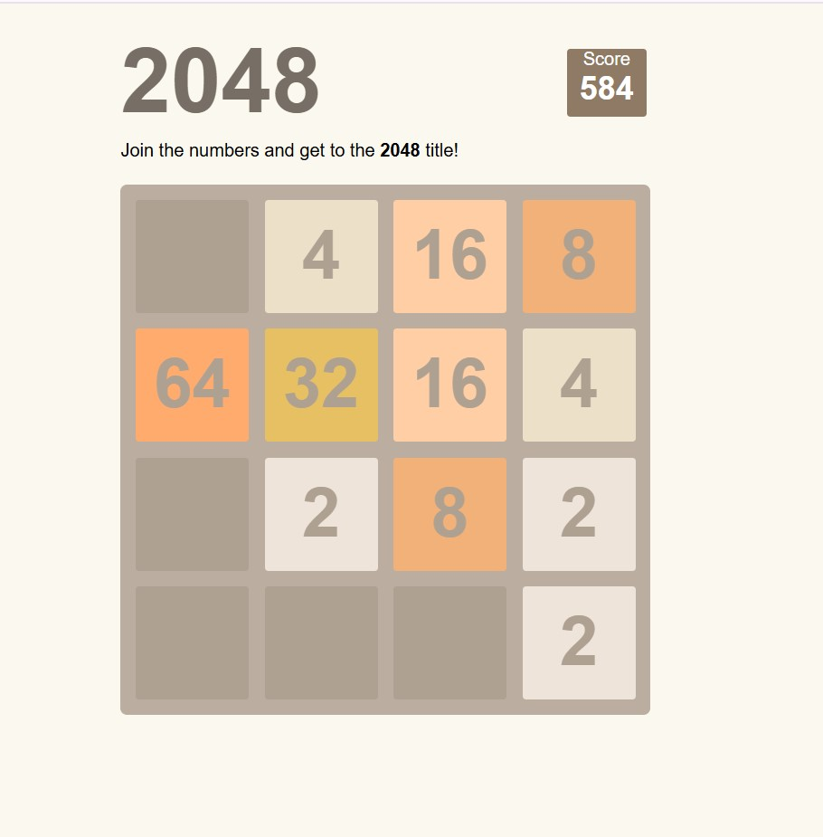

# 2048 Game 🧠🎮

A fun, interactive puzzle game inspired by the original 2048! This project was built using **HTML**, **CSS**, and **JavaScript**, with dynamic tile merging, score tracking, and keyboard controls.

## 🎯 Features

- Fully playable 2048 game (merge tiles with arrow keys)
- Dynamic board updates and animations
- Score tracker
- Game-over detection
- Responsive layout

## 🧪 Tech Stack

- HTML5
- CSS3 (Flexbox/Grid)
- Vanilla JavaScript (Event handling, DOM manipulation)

## 📸 Screenshots

### 💻 View



## 🛠️ Installation

1. Clone the repository:
```bash
git clone https://github.com/rotariu-alexandra/2048-game.git
